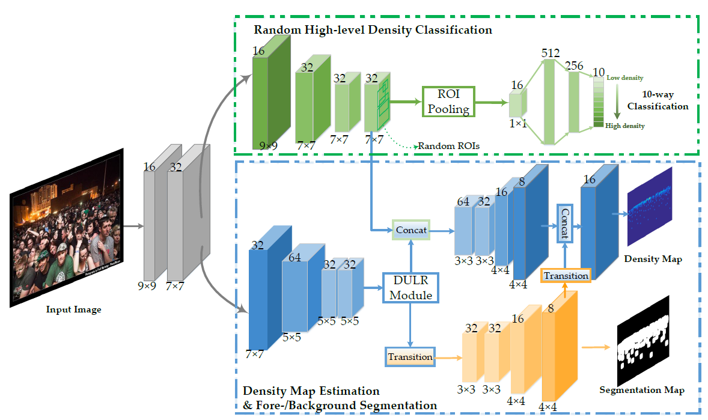
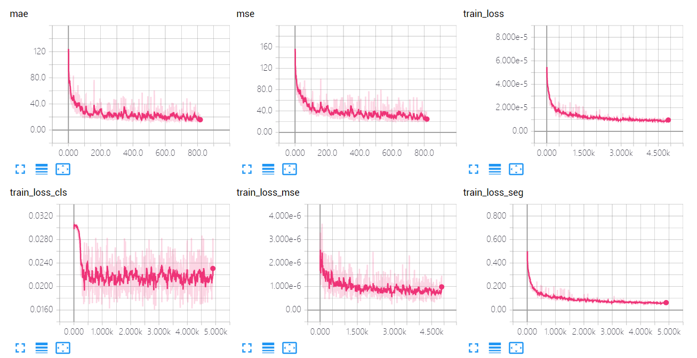
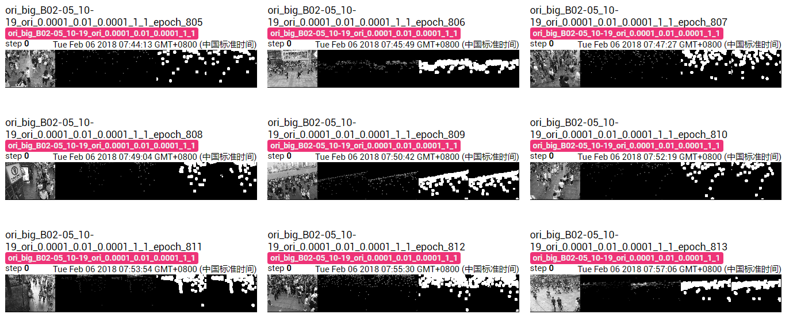

# PCC Net: Perspective Crowd Counting via Spatial Convolutional Network
This is an official implementaion of the paper "PCC Net" (PCC Net: Perspective Crowd Counting via Spatial Convolutional Network).



In the paper, the experiments are conducted on the three populuar datasets: Shanghai Tech, UCF_CC_50 and WorldExpo'10. To be specific, Shanghai Tech Part B contains crowd images with the same resolution. For easier data prepareation, we only release the pre-trained model on ShanghaiTech Part B dataset in this repo.

##  Requirements
- Python 2.7
- Pytorch 0.2.0 
- TensorboardX (pip)
- torchvision  (pip)
- easydict (pip)
- pandas  (pip)

## Installation
```Shell 
cd ./misc/roi_pooling
python build.py
```

## Data preparation
1. Download the original ShanghaiTech Dataset [Link: [Dropbox ](https://www.dropbox.com/s/fipgjqxl7uj8hd5/ShanghaiTech.zip?dl=0)/ [BaiduNetdisk](https://pan.baidu.com/s/1nuAYslz)]
2. Resize the images and the locations of key points. 
3. Generate the density maps by using the [code](https://github.com/aachenhang/crowdcount-mcnn/tree/master/data_preparation).
4. Generate the segmentation maps.

We also provide the processed Part B dataset for training. [[Link](https://mailnwpueducn-my.sharepoint.com/:u:/g/personal/gjy3035_mail_nwpu_edu_cn/EcMLqr9XuH1ChAgkqpxL_6kBK9EyCmIuXMxTb09FrjMYow?e=LJnOcC)]

## Training model
1. Run the train_lr.py: ```python train_lr.py```.
2. See the training outputs: ```Tensorboard --logdir=exp --port=6006```.

In the experiments, training and tesing 800 epoches take 21 hours on GTX 1080Ti. 

## Expermental results

### Quantitative results

We show the Tensorboard visualization results as below:

The mae and mse are the results on test set. Others are triaining loss. 

### Visualization results
Visualization results on the test set as below:

Column 1: input image; Column 2: density map GT; Column 3: density map prediction; Column 4: segmentation map GT; Column 5: segmentation map prediction.


## Tips

In this code, the validation is directly on the test set. Strictly speaking, it is evaluated on val set (randomly selected from training set), which is adoped in the paper. Here, for a comparble reproduction (namely fixed splitting sets), this code directly adopt the test set for validation, which causes that the results of this code are better than that of our paper.

## Citation
If you use the code, please cite the following paper:
